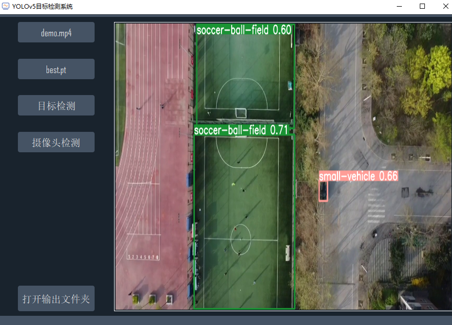

## yolov5_pyqt5

这是一个使用pyqt5+haiKangPython SDK + DS77Lite SDK搭建YOLOv5工业缺陷检测和间隙断差测量可视化程序。

目前支持：
- 工业缺陷检测（划痕，手印，脏污，油污）
- 工业缺陷物理面积测算（结合TOF相机数据，保持误差在0.2mm2）
- 结构光相机+点云对其匹配+KD树最近搜索实现的打印机外立面间隙断差高精度测算，误差保持在毫米级别

项目界面：



项目内置了测试数据，下载之后可直接运行

# 使用方式
1.安装Cuda、Cudnn

根据自己设备GPU型号选择合适版本进行安装

2.安装torch、torchvision

- torch版本：1.7.1
- torchvision版本：0.8.2

在[此处](https://download.pytorch.org/whl/torch_stable.html)根据Cuda版本选择合适的文件下载安装

3.安装剩余模块其它依赖

```
pip install -r requriements.txt
```

4.运行main.py即可看到显示界面


## Contact

本项目不会再添加新功能，如果你发现bug，欢迎在issue中提出，我会及时修复

 

